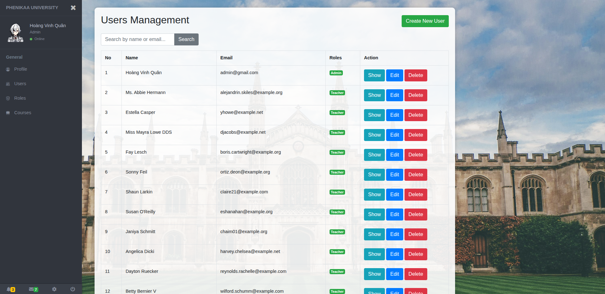

# 🎓 Student Management System

A web application built with **Laravel** for managing students, courses, and grades, with role-based access control.

---

## ✨ Features

- ✅ **Authentication** (login, logout, registration)
- 🧑‍🎓 **Student role**:
  - View available courses
  - Enroll/unenroll from courses
  - View list of classmates
  - View personal grades

- 👨‍🏫 **Teacher role**:
  - View and manage courses they teach
  - Manage enrolled students
  - Input/update student grades

- 🔐 **Admin role**:
  - Manage users and assign roles/permissions
  - Manage roles and permissions via UI

- 📊 Grade management per course
- 🔧 Profile editing with avatar upload
- 🎨 Clean sidebar layout using **Bootstrap 4** and **Font Awesome**

---

## 🛠️ Technologies Used

- PHP 8.x
- Laravel 10.x
- MySQL
- Bootstrap 4
- Font Awesome & Bootstrap Icons
- Laravel Spatie Permission Package

---

## 🚀 Installation & Setup

1. **Clone the repository**

   ```bash
   git clone https://github.com/VinhQuaan/StudentManagement.git
   cd StudentManagement
   ````

2. **Install PHP dependencies**

   ```bash
   composer install
   ```

3. **Install JavaScript dependencies**

   ```bash
   npm install
   ```

4. **Build frontend assets**

   ```bash
   npm run dev
   ```

3. **Create `.env` file**

   ```bash
   cp .env.example .env
   ```

   > Update your database credentials in `.env`

4. **Generate application key**

   ```bash
   php artisan key:generate
   ```

5. **Run migrations and seed roles/users**

   ```bash
   php artisan migrate --seed
   ```

6. **Link storage (for avatars)**

   ```bash
   php artisan storage:link
   ```

7. **Start local development server**

   ```bash
   php artisan serve
   ```

8. Open [http://localhost:8000](http://localhost:8000) in your browser.

---

## 👤 Default Roles

| Role    | Permissions                                                 |
| ------- | ----------------------------------------------------------- |
| Admin   | Manage users, roles, permissions, and view all system data  |
| Teacher | Manage assigned courses, students, and input grades         |
| Student | Enroll in courses, view classmates, and see personal grades |

---

## 📷 Screenshots

<p align="center">
  
</p>

---

## 🤝 Contributing

Pull requests are welcome. For major changes, please open an issue first.

---

## 📧 Contact

Have questions or suggestions?

* 📬 Email: **[hoangquan5824@gmail.com](mailto:hoangquan5824@gmail.com)**
* 💼 GitHub: [VinhQuaan](https://github.com/VinhQuaan)

---
